# 🏗️ Technical Architecture & Data Flow

This document outlines the inner workings of **The Bureaucracy Bulldozer**, including its data flow, component structure, and AI integration.

## 🔄 High-Level Data Flow

The application follows a linear, single-pass data flow pattern: **Input \u2192 Processing \u2192 Output**.

```mermaid
sequenceDiagram
    participant User
    participant Frontend (React)
    participant BulldozerLogic (Backend)
    participant GeminiAPI (Google)

    User->>Frontend: Uploads Image (Site Plan/PDF)
    User->>Frontend: Enters Project Description
    User->>Frontend: Clicks "BULLDOZE"
    
    Frontend->>BulldozerLogic: Call runBulldozerLogic(text, imageBase64)
    
    rect rgb(20, 20, 20)
        note right of BulldozerLogic: Construct System Prompt
        BulldozerLogic->>BulldozerLogic: Inject Persona ("The Bulldozer")
        BulldozerLogic->>BulldozerLogic: Validate Inputs
    end

    BulldozerLogic->>GeminiAPI: POST /models/gemini-2.5-flash:generateContent
    GeminiAPI-->>BulldozerLogic: JSON Response (Verdict, Analysis, Gotcha)
    
    BulldozerLogic-->>Frontend: Return Structured ZoningResult
    
    Frontend->>Frontend: Update Terminal State (Typewriter Effect)
    Frontend->>Frontend: Update Hero Stamp (Approved/Denied)
```



## 🧩 Component Architecture

The frontend is built with **React** and structured as follows:

### 1. `App.tsx` (The Brain)
-   **Role**: Manages the global state (`AppState`, `fileData`, `result`).
-   **Key Function**: `handleBulldoze()` triggers the API call and handles the "shaking" UI effects.
-   **State Machine**:
    -   `IDLE`: Waiting for input.
    -   `ANALYZING`: Waiting for API response (shows loading animations).
    -   `COMPLETE`: Displaying results.
    -   `ERROR`: showing connection failures.

### 2. `backend/bulldozer.ts` (The Logic)
This is a pseudo-backend running in the client (client-side API call).
-   **Inputs**: Text prompt string, Base64 image string.
-   **Prompt Engineering**:
    -   **Persona**: Sets the AI as an "aggressive, hyper-competent Zoning Attorney".
    -   **Context**: Instructs the AI to perform a "Visual Vibe Check" on images or treat text in images as "THE LAW" (OCR).
    -   **Output Schema**: Enforces strict JSON output for `verdict`, `analysis`, `gotcha`, and `actionPlan`.

### 3. `components/Terminal.tsx` (The Output)
-   **Design**: Mimics a retro CRT monitor.
-   **Logic**: Uses a `setInterval` loop to render text character-by-character (typewriter effect).
-   **Auto-scroll**: Automatically keeps the view at the bottom as text generates.

### 4. `components/DropZone.tsx` (The Input)
-   **Features**: Handles drag-and-drop events and file selection.
-   **Previews**: Generates a thumbnail preview for images/PDFs immediately upon selection.

## 🤖 The AI Model (Gemini)

We use **Google Gemini 1.5 Flash** for its speed and multimodal capabilities.

-   **Why Flash?**: Lower latency is critical for the "interactive terminal" feel.
-   **Temperature**: Set to `0.5` (Low-Medium).
    -   *Reason*: We need creativity for the "action plan" but strict adherence to facts when reading zoning documents.

## 📁 Directory Structure

```
/
├── .env.local             # API Keys (Git-ignored)
├── backend/
│   └── bulldozer.ts       # Gemini API integration wrapper
├── components/            # UI Components
│   ├── BulldozeButton.tsx # The big yellow trigger
│   ├── DropZone.tsx       # File input
│   ├── Hero.tsx           # Title & Stamp display
│   ├── Terminal.tsx       # Results display
│   └── ...
├── App.tsx                # Main Application Logic
└── types.ts               # TypeScript Interfaces (ZoningResult, etc.)
```

## 🛡️ Security Note

Currently, this implementation is **Client-Side Only**.
-   **Implication**: Your API Key is exposed to the browser if inspected deeply (though hidden from casual view via Vite env vars).
-   **Production Recommendation**: For a real public deployment, move `bulldozer.ts` to a serverless function (Vercel/Netlify) to keep the API key hidden on the server.
